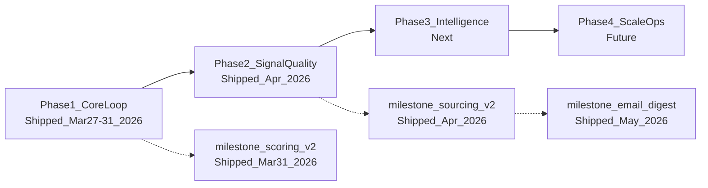
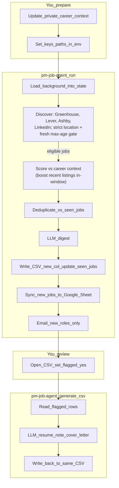

# pm-job-agent

<blockquote>
<p><strong>What this is:</strong> a local-first, LangGraph-orchestrated pipeline that discovers PM roles from public job boards, scores them against <em>your</em> background, exports a reviewable CSV (and optionally a Google Sheet + email digest), and can generate tailored application text on demand.</p>
<p><strong>What it is not (yet):</strong> Slack ingestion, “all jobs on the internet” discovery, or a hosted dashboard — those are roadmap items.</p>
</blockquote>

<details>
<summary><strong>Table of contents</strong></summary>

- [Authorship](#authorship)
- [Roadmap at a glance](#roadmap-at-a-glance)
- [Architecture](#architecture)
  - [Repository layout](#repository-layout)
  - [Why this stack](#why-this-stack)
- [Setup](#setup)
  - [Virtual environment](#virtual-environment-recommended)
  - [Bootstrap script](#bootstrap-script-macos--linux--wsl)
  - [After `git clone`](#after-git-clone-or-git-pull-on-a-new-machine)
  - [Configuration](#configuration)
- [Usage](#usage)
  - [Run the pipeline](#run-the-pipeline)
  - [Generate documents for flagged roles](#generate-documents-for-flagged-roles)
  - [Evaluate and refine scoring quality](#evaluate-and-refine-scoring-quality)
  - [Local development (no API keys required)](#local-development-no-api-keys-required)
  - [GitHub contributions (heatmap)](#github-contributions-heatmap)
- [Automated daily runs](#automated-daily-runs)
- [Tests](#tests)
- [Docker](#docker)
- [Roadmap details](#roadmap-details)
  - [Shipped](#shipped)
  - [Next up](#next-up)

</details>

## Authorship

<p>Author: Ravinder Singh. Personal job-search automation project; career context and secrets live outside Git (<code>private/</code>, <code>.env</code>). Project goals and build phases: see <code>.cursorrules</code>.</p>

## Roadmap at a glance

<p><strong>Where we are:</strong> Phase 1 (core loop) and Phase 2 (signal quality) are shipped. The daily email digest and Sheets sync are production-usable; document generation remains on-demand.</p>

<p><strong>Where we’re going:</strong> Phase 3 adds explainability + memory + richer intelligence; Phase 4 focuses on ops polish (UI, ingestion breadth, Python upgrade).</p>

<p>Deep-dive history: <a href="#shipped">Shipped</a> · <a href="#next-up">Next up</a>.</p>



## Architecture



<p>Discovery applies configurable location rules and a freshness cutoff before scoring; scoring ranks by semantic fit with a configurable recency preference for listings inside the freshness window. Board targets (<code>target_employers</code> plus LinkedIn queries) live in <code>search_profile.yaml</code>; also configurable: <code>freshness_max_days</code>, <code>freshness_boost_under_hours</code>, location list / <code>location_filter</code>.</p>

### Repository layout

| Path | Role |
|------|------|
| `src/pm_job_agent/` | Application package (`config`, `models`, `integrations`, `agents`, `graphs`, `services`, `cli`) |
| `tests/unit/` | Fast tests, mocked HTTP and LLM calls |
| `scripts/` | One-off local scripts |
| `private/` | **Local only** — career context, search profile |
| `outputs/` | **Gitignored** — timestamped CSV run files |

Inside `src/pm_job_agent/`:

| Path | Role |
|------|------|
| `config/` | `Settings` from `.env`; `SearchProfile` loaded from `private/search_profile.yaml` |
| `agents/` | Pipeline nodes: `context`, `discovery`, `scoring`, `deduplicate`, `digest`, `persist`, `sync_sheets`, `notify`, `generation` |
| `graphs/` | LangGraph compile (`build_core_loop_graph`) |
| `models/` | `LLMClient` protocol, `StubLLM`, `get_llm_client()` factory; `providers/` holds Anthropic, OpenAI, Gemini, Ollama |
| `services/` | Shared types (`JobDict`, `RankedJobDict`, `DocumentDict`) and `redact_pii()` |
| `integrations/` | `greenhouse.py`, `lever.py`, `ashby.py`, `linkedin.py` (Apify), `sheets.py` |
| `cli/` | `main.py` (subcommands: `run`, `generate`); `generate_cmd.py` (on-demand generation logic) |

### Why this stack

- **LangGraph** — explicit graph boundaries so each step (discover, score, persist, notify) stays testable and swappable.
- **Pydantic Settings** — typed configuration from environment variables; keeps secrets out of code.
- **httpx** — consistent HTTP for public board APIs and scraping integrations.
- **Provider abstraction** — swap LLM vendors via `.env` without touching agent logic.

---

**What runs today:** A two-step workflow:

1. **`pm-job-agent run`** — discovers jobs from Greenhouse boards, Lever boards, Ashby-hosted boards, and LinkedIn (via Apify), scores each role with LLM semantic scoring (keyword pre-filter + scoring model call against your career context), runs an LLM digest, writes a timestamped CSV to `outputs/`, syncs new jobs to a Google Sheet tracker (if configured), and sends an HTML email digest (if Gmail credentials are configured). Document generation does **not** happen automatically.

2. **`pm-job-agent generate <csv>`** — reads a previous run CSV, generates a tailored resume note and cover letter opening for every row you flagged `yes` in the `flagged` column, and writes the results back into the same file.

LLM providers (Anthropic, OpenAI, Gemini, Ollama) are fully wired and swap via `DEFAULT_LLM_PROVIDER` in `.env` — no code changes needed.

## Setup

### Virtual environment (recommended)

From the repo root:

```bash
python3 -m venv .venv
source .venv/bin/activate   # Windows (cmd): .venv\Scripts\activate.bat
pip install --upgrade pip
pip install -e ".[dev]"
```

`.venv/` is gitignored. Deactivate with `deactivate` when finished.

### Bootstrap script (macOS / Linux / WSL)

```bash
chmod +x scripts/bootstrap.sh   # first time only, if needed
./scripts/bootstrap.sh
source .venv/bin/activate
```

This creates `.venv` if missing, upgrades `pip`, runs `pip install -e ".[dev]"`, and copies `.env.example` → `.env` only when `.env` does not exist (never overwrites).

### After `git clone` or `git pull` on a new machine

**In the remote (GitHub):** source code, `pyproject.toml`, `scripts/bootstrap.sh`, `.env.example`, `Dockerfile`, tests, README.

**Not in the remote (gitignored):** recreate or copy these yourself.

| Path / item | What to do |
|-------------|------------|
| `private/` | Not in Git. Three files matter: `agent-context.md` (career context for scoring/generation), `search_profile.yaml` (targets, optional `target_employers`, LinkedIn queries), and `scoring_criteria.md` (optional personalised scoring rubric injected into the LLM system prompt). Without `agent-context.md` and `search_profile.yaml`, discovery returns zero jobs but the run does not crash. |
| `.env` | Not in Git. Run `./scripts/bootstrap.sh` to create from `.env.example`, then fill in real keys. |
| `.venv/` | Not in Git. Run `./scripts/bootstrap.sh` or `pip install -e ".[dev]"` manually. |
| `outputs/` | Gitignored. Created automatically on first run. |

**Order after clone:**

1. Install Python 3.9+ and Git.
2. `cd` into the repo root.
3. `./scripts/bootstrap.sh`
4. Restore `private/` and fill in `.env` with real secrets.
5. `source .venv/bin/activate` and run `pytest`.

**New machine / fresh clone checklist (fast path)**

This repo intentionally does **not** store secrets or personal context in Git. Keep a secure backup of your `.env` and `private/` folder (password manager or encrypted storage), then use this checklist:

1. `git clone ... && cd pm-job-agent`
2. Restore:
   - `.env` (or `cp .env.example .env` then fill keys)
   - `private/agent-context.md`
   - `private/search_profile.yaml`
   - optional `private/scoring_criteria.md`
   - optional `private/service_account.json` (Sheets)
3. `./scripts/bootstrap.sh`
4. `source .venv/bin/activate`
5. Smoke test (cheap, no paid LLM): `pm-job-agent run --provider stub`

### Configuration

1. **Environment variables** — copy the template and edit locally:

   ```bash
   cp .env.example .env
   ```

2. **LLM provider** — install the SDK and set the key in `.env`:

   | Provider | Install | `.env` keys |
   |----------|---------|-------------|
   | Anthropic | `pip install -e ".[anthropic]"` | `ANTHROPIC_API_KEY`, optionally `ANTHROPIC_MODEL` |
   | OpenAI | `pip install -e ".[openai]"` | `OPENAI_API_KEY`, optionally `OPENAI_MODEL` |
   | Gemini | `pip install -e ".[gemini]"` | `GOOGLE_API_KEY`, optionally `GEMINI_MODEL` |
   | Ollama (local) | `pip install -e ".[ollama]"` | `OLLAMA_BASE_URL`, `OLLAMA_MODEL` |
   | All providers | `pip install -e ".[llm-all]"` | — |

   Set `DEFAULT_LLM_PROVIDER=anthropic` (or your chosen provider) in `.env`. The default is `stub` — makes no API calls, used for CI and runs without keys.

3. **LinkedIn via Apify** — get a free API token at [console.apify.com/account/integrations](https://console.apify.com/account/integrations) and add it to `.env`:

   ```
   APIFY_API_TOKEN=apify_api_xxxxxxxxxxxx
   ```

   Without this key, LinkedIn discovery is silently skipped; Greenhouse, Lever, and Ashby posting APIs still run normally (no API key required).

4. **Email digest (optional)** — after each run, the pipeline can send a formatted HTML email (tier highlights + tracker link). Requires a Gmail App Password (not your account password):

   1. Enable 2-Step Verification on your Google account.
   2. Go to [myaccount.google.com/apppasswords](https://myaccount.google.com/apppasswords) and create an App Password for "Mail".
   3. Add to `.env`:

   ```
   GMAIL_SENDER=you@gmail.com
   GMAIL_APP_PASSWORD=xxxx xxxx xxxx xxxx
   NOTIFY_EMAIL=you@gmail.com
   NOTIFY_TOP_N=3
   # Optional tuning knobs:
   # NOTIFY_HIGH_SCORE_MIN=0.80   # "highly relevant" tier
   # NOTIFY_NEXT_SCORE_MIN=0.50   # "next tier"
   ```

   Without these keys, the notify step is silently skipped — the run completes normally and only the CSV is written.

5. **Google Sheets tracker (optional)** — after each run, new jobs are appended to a single persistent Google Sheet. This is your cross-run tracker: sort by score, update `status` (applied / interested / skipped), add notes. The pipeline never overwrites your edits.

   **One-time setup:**

   1. Go to [console.cloud.google.com](https://console.cloud.google.com), create a project, and enable the **Google Sheets API**.
   2. Under **IAM & Admin → Service Accounts**, create a service account. Under its **Keys** tab, add a key → JSON. Save the downloaded file as `private/service_account.json` (gitignored).
   3. Create a blank Google Sheet. Copy its ID from the URL — the long alphanumeric string between `/d/` and `/edit`.
   4. Share the Sheet with the service account's `client_email` (found in the JSON key file) — give it **Editor** access.
   5. Add to `.env`:

   ```
   GOOGLE_SHEETS_ID=your_sheet_id_here
   # GOOGLE_SERVICE_ACCOUNT_PATH defaults to private/service_account.json
   ```

   **Sheet columns written by the pipeline:**

   | Column | Set by |
   |--------|--------|
   | `job_id`, `title`, `company`, `location`, `url`, `score`, `source`, `discovered_date`, `source_posted_at`, `new` | Pipeline on append (never overwritten) |
   | `status`, `notes` | You — pipeline never touches these |
   | `resume_note`, `cover_letter` | Reserved for `pm-job-agent generate` (future) |

   Without these settings, the `sync_sheets` step is silently skipped — the run completes normally with only the CSV written.

   **For GitHub Actions:** add `GOOGLE_SHEETS_ID` and `GOOGLE_SERVICE_ACCOUNT_JSON` (full JSON content of the key file) as repository secrets.

6. **Career context** — add or edit `private/agent-context.md` (gitignored). Set `AGENT_CONTEXT_PATH` in `.env` if you want a different path.

7. **Search profile** — edit `private/search_profile.yaml`:

   ```yaml
   target_titles:
     - "Product Manager"
     - "Senior PM"

   include_keywords:
     - "AI"
     - "LLM"

   exclude_keywords:
     - "Intern"

   # Preferred: one row per employer — set only the ATS slugs that company uses.
   target_employers:
     - name: Anthropic
       greenhouse: anthropic
     - name: Notion
       lever: notion
     - name: Example Co
       ashby: example-co

   linkedin_search_queries:
     - "AI Product Manager"
     - "Senior PM AI"
   ```

   **Board slugs:** `greenhouse` values are tokens from `boards.greenhouse.io/<token>/`. `lever` values are slugs from `jobs.lever.co/<slug>/`. `ashby` values are job board names from `jobs.ashbyhq.com/<name>/` ([Ashby posting API](https://developers.ashbyhq.com/docs/public-job-posting-api)). All three ATS reads are unauthenticated. Each row needs at least one of `greenhouse`, `lever`, or `ashby`. `name` is written to CSV/Sheet `company` (omit it and the first slug is used as the label). Optionally list multiple ATS keys on the same row if the employer posts duplicates you want to collapse under one name.

   **Backward compatibility:** if `target_employers` is missing or empty, the loader falls back to separate `greenhouse_board_tokens`, `lever_board_tokens`, and `ashby_board_names` lists (same behavior as before). If `target_employers` is **non-empty**, those legacy three keys are **ignored** for discovery — drop them from YAML or Actions `SEARCH_PROFILE_YAML` after migrating to avoid confusion.

   **Troubleshooting board 404s:** If logs show `Lever board '…' not found (404)` or `Ashby board '…' not found (404)`, the slug no longer matches that vendor’s public careers URL (many companies move from Lever to Ashby or rename their board). Remove the stale `lever:` or `ashby:` key from that `target_employers` row, or fix the slug by opening the employer’s live jobs page and copying the path segment. Greenhouse raises a hard error instead of 404-to-empty; treat “HTTP 404” the same way — token wrong or board private. Duplicate warnings on every run mean the row still lists a dead board.

   There is still no global “all companies” feed — you curate employers yourself. Same role on multiple sources collapses via `(company, title)` dedup once `name` aligns. Ashby exposes ISO `publishedAt` as CSV `source_posted_at`; freshness resolves ISO and LinkedIn relative strings.

   **`linkedin_search_queries`** are keyword searches (different model from board slugs) — be specific. With `location_filter: strict` (the default when you set `locations`), jobs whose non-empty `location` does not contain any of your substrings are dropped after discovery; use `location_filter: soft` for LLM-only geography. Optional `linkedin_location`, `linkedin_date_posted` (Apify codes such as `r604800`), and `linkedin_sort_by` tune the LinkedIn actor. `freshness_max_days` (default `5`) hard-filters older roles; `freshness_boost_under_hours` (default `24`) prefers recent roles in ranking (`<=` boundary). The run CSV includes `source_posted_at`, `freshness_age_hours`, and `freshness_basis`. In Sheets, `discovered_date` is pipeline first-seen, not the employer’s post date — compare with `source_posted_at`. Without meaningful board + LinkedIn config, discovery returns few or no jobs.

## Usage

### Run the pipeline

```bash
pm-job-agent run
```

Runs discovery (Greenhouse + Lever + Ashby + LinkedIn) → scoring → digest → CSV → email. Produces `outputs/run_YYYYMMDD_HHMMSS.csv` with review columns (`flagged`) and freshness audit columns (`source_posted_at`, `freshness_age_hours`, `freshness_basis`). If `GMAIL_APP_PASSWORD` is set, sends an HTML email digest to `NOTIFY_EMAIL` that (a) shows a one-sentence “New highlights” summary, (b) lists up to `NOTIFY_TOP_N` roles in the highly relevant tier and the next tier (default 3 each), and (c) includes a link to the Google Sheet tracker if configured.

```bash
pm-job-agent run --json   # print full graph state as JSON (includes agent_context — treat as sensitive)
```

### Generate documents for flagged roles

Open the CSV, set `flagged = yes` for the roles you want to apply to, then:

```bash
pm-job-agent generate outputs/run_YYYYMMDD_HHMMSS.csv
```

Reads every `flagged = yes` row, calls the LLM for a tailored resume note and cover letter opening for each, and writes the results back into the same CSV. Unflagged rows are untouched.

### Evaluate and refine scoring quality

The LLM scorer is only as good as the rubric in `private/scoring_criteria.md`. Use this workflow to spot where it's over- or under-scoring and tighten it:

**Step 1 — Sample jobs across score buckets**

```bash
python scripts/sample_for_review.py          # 3 jobs per bucket (~12 total)
python scripts/sample_for_review.py --n 5    # larger sample
python scripts/sample_for_review.py --seed 42  # reproducible sample
```

Pools all `outputs/run_*.csv` files, stratifies into STRONG / PROMISING / BORDERLINE / WEAK, prints each job with its score and rationale, and writes `private/sample_for_review.csv`.

**Step 2 — Fill in your scores**

Open `private/sample_for_review.csv` and fill in `your_score` (1–5) and `your_notes` for each job. Look for patterns where the LLM consistently diverges from your judgment.

**Step 3 — Update the rubric**

Edit `private/scoring_criteria.md` to correct the patterns you found (e.g. "downgrade pre-Series A roles", "ignore titles without AI scope").

**Step 4 — Re-score the Sheet**

```bash
python scripts/rescore_sheet.py --write
```

Re-evaluates all Sheet rows with the updated rubric and writes back `score` and `score_rationale`.

### Local development (no API keys required)

Use the `--provider` flag to override the LLM provider for a single command without editing `.env`. This is the recommended workflow for local testing:

```bash
ollama pull llama3.2          # one-time model download (~2 GB); skip if already pulled
pm-job-agent run --provider ollama
pm-job-agent generate outputs/run_*.csv --provider ollama
```

Requires [Ollama](https://ollama.com) installed and running (`ollama serve`). `llama3.2` produces reliable structured JSON output and is the recommended model for scoring. All other settings (search profile, output directory, Google Sheets, email digest) are unaffected by `--provider`.

`--provider` accepts any configured provider: `stub | anthropic | openai | gemini | ollama`. `stub` is useful for smoke-testing the pipeline shape without any LLM calls.

### GitHub contributions (heatmap)

<p>Commits only affect your contribution graph when GitHub attributes them to a <strong>verified email</strong> on your account. Work on a feature branch still counts once those commits land on the repository’s default branch (typically via merge). Verify the author email on your last commit with <code>git log -1 --format='%ae'</code>.</p>

## Automated daily runs

The pipeline runs automatically on weekday mornings via GitHub Actions (`.github/workflows/daily_run.yml`). The cron fires at a time chosen to avoid Anthropic peak-demand windows.

**Repository secrets required** (Settings → Secrets and variables → Actions):

| Secret | What it holds |
|--------|---------------|
| `AGENT_CONTEXT_MD` | Contents of `private/agent-context.md` |
| `SCORING_CRITERIA_MD` | Contents of `private/scoring_criteria.md` (optional; omit if not using personalised scoring criteria) |
| `SEARCH_PROFILE_YAML` | Contents of `private/search_profile.yaml` |
| `ANTHROPIC_API_KEY` | LLM provider key |
| `APIFY_API_TOKEN` | LinkedIn scraping |
| `GMAIL_APP_PASSWORD` | Gmail app password for digest email |
| `GMAIL_SENDER` | Sender address |
| `NOTIFY_EMAIL` | Recipient address |

**Optional secrets (Google Sheets tracker):**

| Secret | What it holds |
|--------|---------------|
| `GOOGLE_SHEETS_ID` | Sheet ID from the URL — enables cross-run tracker |
| `GOOGLE_SERVICE_ACCOUNT_JSON` | Full contents of `private/service_account.json` |

`private/seen_jobs.json` is persisted between runs via `actions/cache` keyed on the day's date. This is what prevents the same jobs from appearing in the digest every day.

To trigger a manual run: Actions tab → `Daily job digest` → `Run workflow`.

## Tests

```bash
pytest
```

## Docker

```bash
docker build -t pm-job-agent .
```

The build context excludes `private/`, `.env`, and virtualenvs via `.dockerignore`.

## Roadmap details

### Shipped

**Phase 1 — Core Loop** _(Mar 27–30 2026)_

Scaffold → Greenhouse discovery → keyword scoring → real LLM providers → on-demand document generation → LinkedIn/Apify scraping → cross-run deduplication → email digest → GitHub Actions cron → Google Sheets tracker.

**`feature/scoring-v2`** ✓ Shipped Mar 31 2026

Replaced keyword scoring with LLM semantic scoring (keyword pre-filter + per-job LLM call against `agent-context.md`). Added `SCORING_LLM_PROVIDER` / `SCORING_MODEL` for model tiering, `SCORING_CRITERIA_PATH` to inject a personalised rubric into the system prompt, `score_rationale` field in CSV and Sheet, `--provider` CLI flag for local Ollama testing, `scripts/eval_scoring.py` for oracle-based quality validation, and `scripts/rescore_sheet.py` to back-fill v2 scores on existing Sheet rows.

**Quality validation (Mar 31 2026):** Ran `eval_scoring.py` against today's 191-job run (20-job oracle sample): MAE 0.189, Spearman 0.621. Scoring model is directionally correct and identifies domain/seniority gaps accurately; slight conservative bias (~0.19 below oracle) expected given cheaper scoring model. Pre-filter correctly drops non-AI-adjacent roles. Ran `rescore_sheet.py --write` against all 244 historical Sheet rows: average score rose from 0.139 (keyword noise) to 0.307 (semantic), 87 large changes (>0.30). Notable rescores: `Principal PM, AI @ Webflow` 0.40 → 0.82, `Product Manager, Subscription & Payments @ Webflow` 0.40 → 0.72.

**`feature/sourcing-v2`** ✓ Shipped Apr 2026

Tightened LinkedIn search queries for better signal-to-noise. Added Greenhouse 404 handling (stale board tokens now skip silently). Added `scripts/sample_for_review.py` for stratified human scoring workflow. Added minimum description length pre-filter to drop generic listings before LLM scoring. Added (company, title) cross-source deduplication to collapse duplicate postings from multiple LinkedIn queries or boards.

**`feature/lever-integration`** ✓ Shipped Apr 2026

Added Lever as a third job source (no API key required). `LeverClient` queries the public Lever posting API per company slug, filters by target titles, and gracefully skips 404 boards. `lever_board_tokens` added to `SearchProfile`. Source block wired into `discovery.py` after LinkedIn.

**Ashby + unified `target_employers`** ✓ Shipped Apr 2026

Added Ashby’s public [posting API](https://developers.ashbyhq.com/docs/public-job-posting-api) as a fourth board source (no API key). Introduced YAML `target_employers`: one row per employer with optional `greenhouse`, `lever`, and `ashby` keys plus `name` for CSV/Sheet `company` and clearer `(company, title)` dedup. Legacy `greenhouse_board_tokens` / `lever_board_tokens` / `ashby_board_names` remain supported when `target_employers` is absent or empty; when it is non-empty, legacy board lists are ignored for discovery. Board clients accept an optional display label; ISO `publishedAt` from Ashby is included in freshness resolution alongside LinkedIn-style relative post times.

**Email digest relevance tiers** ✓ Shipped May 2026

Email shows a one-sentence “New highlights” line, tiered role lists (highly relevant, then next tier), optional link copy to open the full Google Sheet tracker, and uses `NOTIFY_TOP_N` as the per-tier cap (default 3).

### Next up

**Application tracking consolidation (future)**

- Merge your “already applied” tracker into the Google Sheet so job search status is centralized.
- Likely needs nuance beyond a single `status` cell (timestamps, source of truth, dedup between systems, and whether the pipeline should ever write to these fields).

**`feature/sheets-ui`**

Format `title` as `=HYPERLINK(url, title)` for one-click access. Score as percentage. Document a filter view setup for daily review. Low value until data quality upstream is fixed.

Key decisions: `USER_ENTERED` vs `RAW` for append (risk: job titles containing `=` misinterpreted as formulas).

#### Phase 3 — Intelligence layer

- **Explainability** — store LLM rationale per job in CSV and Sheet; surface top reasons in digest
- **Application memory** — track outcomes (applied, interviewed, rejected); recalibrate scoring over time; likely needs SQLite in `private/`
- **Predictive company intelligence** — monitor funding signals (Crunchbase, Harmonic) for companies likely to hire PMs before they post; separate "watchlist" section in digest email

#### Phase 4 — Scale and ops

- **Slack ingestion** — ingest job posts from a channel (bot needs `channels:history` scope)
- **Streamlit UI** — local web app for reviewing, filtering, updating status; most demonstrable as portfolio artifact
- **Python 3.11+ upgrade** — `google-auth` and `urllib3` both warn on 3.9 (EOL); low risk, removes noise

### LLM cost efficiency (cross-cutting)

This applies across all phases and should be revisited whenever a new LLM-heavy feature is added.

- **Model tiering** — use cheap models (Haiku, GPT-4o-mini, Gemini Flash) for high-volume structured tasks (scoring, classification) and reserve stronger models (Sonnet, GPT-4o) for quality-sensitive generation (resume notes, cover letters, digest). Controlled via `SCORING_LLM_PROVIDER` / `SCORING_MODEL` settings added in `feature/scoring-v2`.
- **Batching** — where possible, score multiple jobs in a single LLM call rather than one call per job. Reduces latency and token overhead from repeated system prompts. Tradeoff: harder to parse structured output reliably; test carefully.
- **Prompt caching** — Anthropic and OpenAI both support prompt caching for repeated system prompt content. `agent-context.md` is a prime candidate — it's sent on every scoring call and never changes within a run. Can reduce input token cost by 80%+ on cached content.
- **Pre-filtering** — keep keyword matching as a fast, free first pass to eliminate obvious non-matches before any LLM call. Only jobs that pass a minimum keyword threshold get LLM-scored. Reduces LLM call volume by ~30-50% with minimal quality loss.
- **Token budgets** — cap `description_snippet` length before sending to the LLM. The current 500-char snippet is reasonable; don't increase it without measuring cost impact.

### Tech debt

| Item | Severity | Notes |
|------|----------|-------|
| Python 3.9 EOL | Medium | `google-auth` will eventually drop support; warnings on every run |
| Keyword scoring | High | Fixed — shipped in `feature/scoring-v2` |
| LLM scoring latency | Medium | 150-200 calls/run at ~0.3s each = ~60s added; batching strategy needed |
| Greenhouse 404s | Low | Auto-verify in `feature/sourcing-v2` will fix permanently |
| GitHub Actions cache key | Low | Fixed — key is now `seen-jobs-v1-${{ github.run_id }}` with `restore-keys` fallback; each run saves a unique entry and restores the most recent |
| gspread `update()` argument order | Low | Fixed — `rescore_sheet.py` now uses named args `update(values=..., range_name=...)` |
| Meta/LinkedIn duplicates | Medium | ~20 identical "Product Manager @ Meta" rows from same scrape; dedup by (company, title) needed in `feature/sourcing-v2` |
