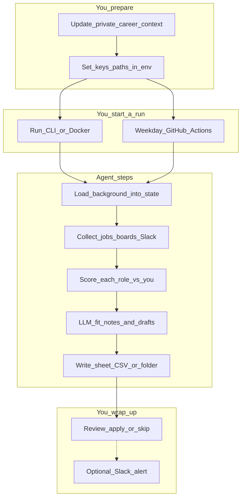

# pm-job-agent

Multi-agent job hunting system: LangGraph orchestration, job discovery (Greenhouse, Adzuna; later Slack channel ingestion), scoring against your background, tailored documents, spreadsheet export, and optional Slack alerts (see `.cursorrules` for goals and phases).

**What runs today:** From the CLI you get a full **pipeline skeleton**: load career context from `AGENT_CONTEXT_PATH`, **discover** jobs (still an empty stub), **score** with placeholder values, then run a **stub** LLM for a short **digest**. That matches the “context → jobs → scores → narrative” shape so real integrations can drop in without reshaping the graph.

**Not in code yet:** calling Greenhouse/Adzuna/Slack, real fit scoring, writing to Google Sheets/CSV, and optional Slack notifications. The diagram below is a **sample user journey**; today’s code runs through **read background → digest** with stubs where **gather**, **persist**, and Slack would plug in.

## Architecture

Below is a **sample user flow** in order: what *you* do, how a run starts, what the *agent* does in the core loop, and how you close the loop. It maps to LangGraph (load context → discover → score → digest → export). **API keys** and paths live in `.env` (or **GitHub Secrets** in CI).



Solid lines are the main path. **Gather** is where Greenhouse, Adzuna, and (later) Slack channel ingestion connect. **`-.->`** is optional and not implemented yet. Code layout: **Layout** maps these steps to `agents/`, `integrations/`, and `graphs/`.

## Setup

### Virtual environment (recommended)

**Yes — use a virtual environment** on every machine (laptop, desktop, or Pi). It keeps dependencies out of your system Python, avoids version clashes across projects, and matches what most tutorials and CI images assume.

From the repo root:

```bash
python3 -m venv .venv
source .venv/bin/activate   # Windows (cmd): .venv\Scripts\activate.bat
pip install --upgrade pip
pip install -e ".[dev]"
```

`.venv/` is gitignored. Deactivate with `deactivate` when finished.

### Bootstrap script (macOS / Linux / WSL)

From the repo root, one shot:

```bash
chmod +x scripts/bootstrap.sh   # first time only, if needed
./scripts/bootstrap.sh
```

This creates `.venv` if missing, upgrades `pip`, runs `pip install -e ".[dev]"`, and copies `.env.example` → `.env` **only when `.env` does not exist** (never overwrites). Then activate:

```bash
source .venv/bin/activate
```

Use `PYTHON=/path/to/python3.12 ./scripts/bootstrap.sh` if `python3` is not the interpreter you want. **Windows (cmd/PowerShell):** use the manual venv steps above, or run the script under **Git Bash / WSL**.

### After `git clone` or `git pull` on a new machine

`git` only updates **tracked** files. It does **not** restore local-only material. On every new computer (including a **Raspberry Pi** after you clone or pull this repo), you still need the items below.

**In the remote (GitHub):** source code, `pyproject.toml`, `scripts/bootstrap.sh`, `.env.example`, `Dockerfile`, tests, README, etc.

**Not in the remote (gitignored or never committed):** recreate or copy these yourself.

| Path / item | What to do |
|-------------|------------|
| `private/` | Not in Git. Restore from your own backup (USB, encrypted sync, etc.) or recreate files such as `private/agent-context.md`. Without this, scoring and generation have no career context unless you point `AGENT_CONTEXT_PATH` elsewhere. |
| `.env` | Not in Git. After clone, run `./scripts/bootstrap.sh` to create `.env` from `.env.example` **only if** `.env` is missing; then fill in real API keys. Or copy a backed-up `.env` onto the machine (bootstrap will not overwrite an existing `.env`). |
| `.venv/` | Not in Git. Run `./scripts/bootstrap.sh` from the repo root, or create a venv and `pip install -e ".[dev]"` manually. |
| `outputs/`, `var/` | Gitignored scratch/output dirs; created as needed. |

**Suggested order after clone or `git pull` on a fresh environment:**

1. Install **Git** and **Python 3.9+** (see the hardware table below). On Debian/Ubuntu-based systems you may need `build-essential` (and sometimes `python3-venv`) before bootstrap if packages must compile from source (common on **ARM** / Pi when wheels are missing).
2. `cd` into the repo root.
3. `./scripts/bootstrap.sh` (creates `.venv` and installs the package; seeds `.env` only if absent).
4. Restore **`private/`** and ensure **`.env`** holds your real secrets (if bootstrap created `.env`, replace placeholders).
5. `source .venv/bin/activate` and run `pytest`. In **Cursor / VS Code**, set **Python: Select Interpreter** to `./.venv/bin/python` so the editor matches the venv.

Pulling new commits on a machine **that already has** `.venv`, `private/`, and `.env` usually only requires `git pull`; re-run `./scripts/bootstrap.sh` if `pyproject.toml` dependencies changed or you want a clean reinstall (`rm -rf .venv` first).

**Raspberry Pi:** Phase 1 is not optimized for Pi (see `.cursorrules`). Expect slower `pip` installs and possible extra build tools on **ARM**. If dependency installs fail, install compilers (`sudo apt install build-essential python3-dev`) and retry. For a low-friction path, run the agent on a laptop or in **GitHub Actions** and use the Pi only if you accept that friction.

### Recommended hardware and OS

| Context | Notes |
|--------|--------|
| **Day-to-day development** | macOS or Linux on a normal laptop/desktop is ideal. This project calls **remote LLM and job APIs** in Phase 1; you do not need a GPU. **8 GB RAM** is workable; **16 GB** is comfortable if you run Docker and a browser together. |
| **Clean reinstall / new machine** | Install Python 3.9+ (3.11+ preferred), Git, then follow the venv steps above. Restore secrets via `.env` or your password manager; restore career files under `private/` manually or from your own backup (they are not in Git). |
| **Docker** | Matches CI/production-like runs on **x86_64 or arm64** with Docker Desktop / Engine. Official images are multi-arch where noted; builds are slower on low-power ARM. |
| **Raspberry Pi** | Phase 1 is **not** scoped to Raspberry Pi (see `.cursorrules`). If you still clone there: use a **64-bit** OS, Python **3.11+** if available, `python3 -m venv .venv`, and expect **slow** installs or missing wheels for some scientific/ML stacks as the project grows—build tools (`build-essential`) may be required. Prefer running the agent on your laptop or in **GitHub Actions**; use the Pi only if you accept tinkering. |

**Prerequisite:** Python **3.9+** on your PATH (3.11+ recommended; the `Dockerfile` uses 3.12).

1. **Environment variables** — copy the template and edit locally (file is gitignored). Skip `cp` if `./scripts/bootstrap.sh` already created `.env`.

   ```bash
   cp .env.example .env
   ```

   Put real API keys and tokens only in `.env` or your shell. In GitHub Actions, use repository **Secrets**, not committed files.

2. **Career context** — add or edit `private/agent-context.md` (gitignored). Optional: set `AGENT_CONTEXT_PATH` in `.env` to another path for CI or different machines.

## Layout

| Path | Role |
|------|------|
| `src/pm_job_agent/` | Application package (`config`, `models`, `integrations`, `agents`, `graphs`, `services`, `cli`) |
| `tests/unit/` | Fast tests, mocked HTTP |
| `tests/integration/` | Tests that call real APIs (optional; skip without keys) |
| `scripts/` | One-off local scripts |
| `docker/` | Extra container assets (optional) |
| `private/` | **Local only** — resume, project write-ups, agent context |

Inside `src/pm_job_agent/`:

| Path | Role |
|------|------|
| `config/` | Settings from `.env` (`AGENT_CONTEXT_PATH`, `DEFAULT_LLM_PROVIDER`, future API keys) |
| `agents/` | Pipeline nodes: load context, discover, score, digest |
| `graphs/` | LangGraph compile (`build_core_loop_graph`); package `__init__` uses a lazy import to avoid cycles |
| `models/` | `LLMClient` protocol, `StubLLM`, `get_llm_client()` |
| `services/` | Shared types (`JobDict`, `RankedJobDict`) |
| `integrations/` | Reserved for HTTP clients (boards, Slack read) — empty stubs until wired |
| `cli/` | `python -m pm_job_agent` |

`tests/conftest.py` clears the cached `get_settings()` between tests so environment changes apply.

Generated artifacts that might contain PII should go under `outputs/` or `var/` (both gitignored).

## Tests

```bash
pytest
```

## Core loop (Phase 1)

After `./scripts/bootstrap.sh` and `source .venv/bin/activate`, run the graph once. In plain terms the steps are: **read your private context file → fetch jobs (none yet) → attach placeholder scores → ask the stub LLM for a two-sentence style digest** so the wiring is real even before APIs land.

```bash
python -m pm_job_agent
# equivalent if your venv’s scripts dir is on PATH:
# pm-job-agent
```

JSON state (includes full `agent_context` text — **do not paste into public channels**):

```bash
python -m pm_job_agent --json
```

`DEFAULT_LLM_PROVIDER=stub` is the default in `.env.example` until real providers are implemented in `get_llm_client()`.

## Docker

```bash
docker build -t pm-job-agent .
```

The build context excludes `private/`, `.env`, and virtualenvs via `.dockerignore`.
