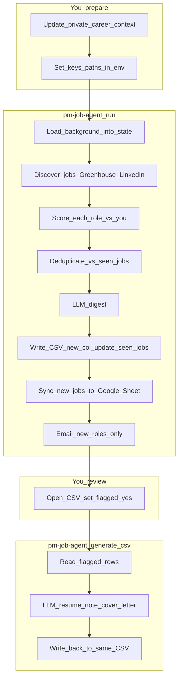

# pm-job-agent

Multi-agent job hunting system: LangGraph orchestration, job discovery (Greenhouse + LinkedIn via Apify), scoring against your background, tailored documents on demand, and CSV export. See `.cursorrules` for goals and phases.

**What runs today:** A two-step workflow:

1. **`pm-job-agent run`** — discovers jobs from Greenhouse boards and LinkedIn (via Apify), scores each role with keyword matching, runs an LLM digest, writes a timestamped CSV to `outputs/`, syncs new jobs to a Google Sheet tracker (if configured), and sends an HTML email digest (if Gmail credentials are configured). Document generation does **not** happen automatically.
2. **`pm-job-agent generate <csv>`** — reads a previous run CSV, generates a tailored resume note and cover letter opening for every row you flagged `yes` in the `flagged` column, and writes the results back into the same file.

LLM providers (Anthropic, OpenAI, Gemini, Ollama) are fully wired and swap via `DEFAULT_LLM_PROVIDER` in `.env` — no code changes needed.

**Not in code yet:** Slack channel ingestion, Slack notifications, additional job sources (YCombinator, TrueUp, Indeed), predictive company intelligence (funding signals → proactive outreach).

## Architecture



## Setup

### Virtual environment (recommended)

From the repo root:

```bash
python3 -m venv .venv
source .venv/bin/activate   # Windows (cmd): .venv\Scripts\activate.bat
pip install --upgrade pip
pip install -e ".[dev]"
```

`.venv/` is gitignored. Deactivate with `deactivate` when finished.

### Bootstrap script (macOS / Linux / WSL)

```bash
chmod +x scripts/bootstrap.sh   # first time only, if needed
./scripts/bootstrap.sh
source .venv/bin/activate
```

This creates `.venv` if missing, upgrades `pip`, runs `pip install -e ".[dev]"`, and copies `.env.example` → `.env` only when `.env` does not exist (never overwrites).

### After `git clone` or `git pull` on a new machine

**In the remote (GitHub):** source code, `pyproject.toml`, `scripts/bootstrap.sh`, `.env.example`, `Dockerfile`, tests, README.

**Not in the remote (gitignored):** recreate or copy these yourself.

| Path / item | What to do |
|-------------|------------|
| `private/` | Not in Git. Two files matter: `agent-context.md` (career context for scoring/generation) and `search_profile.yaml` (keywords, board tokens, LinkedIn queries). Without these, discovery returns zero jobs but the run does not crash. |
| `.env` | Not in Git. Run `./scripts/bootstrap.sh` to create from `.env.example`, then fill in real keys. |
| `.venv/` | Not in Git. Run `./scripts/bootstrap.sh` or `pip install -e ".[dev]"` manually. |
| `outputs/` | Gitignored. Created automatically on first run. |

**Order after clone:**

1. Install Python 3.9+ and Git.
2. `cd` into the repo root.
3. `./scripts/bootstrap.sh`
4. Restore `private/` and fill in `.env` with real secrets.
5. `source .venv/bin/activate` and run `pytest`.

### Configuration

1. **Environment variables** — copy the template and edit locally:

   ```bash
   cp .env.example .env
   ```

2. **LLM provider** — install the SDK and set the key in `.env`:

   | Provider | Install | `.env` keys |
   |----------|---------|-------------|
   | Anthropic | `pip install -e ".[anthropic]"` | `ANTHROPIC_API_KEY`, optionally `ANTHROPIC_MODEL` |
   | OpenAI | `pip install -e ".[openai]"` | `OPENAI_API_KEY`, optionally `OPENAI_MODEL` |
   | Gemini | `pip install -e ".[gemini]"` | `GOOGLE_API_KEY`, optionally `GEMINI_MODEL` |
   | Ollama (local) | `pip install -e ".[ollama]"` | `OLLAMA_BASE_URL`, `OLLAMA_MODEL` |
   | All providers | `pip install -e ".[llm-all]"` | — |

   Set `DEFAULT_LLM_PROVIDER=anthropic` (or your chosen provider) in `.env`. The default is `stub` — makes no API calls, used for CI and runs without keys.

3. **LinkedIn via Apify** — get a free API token at [console.apify.com/account/integrations](https://console.apify.com/account/integrations) and add it to `.env`:

   ```
   APIFY_API_TOKEN=apify_api_xxxxxxxxxxxx
   ```

   Without this key, LinkedIn discovery is silently skipped and Greenhouse runs normally.

4. **Email digest (optional)** — after each run, the pipeline can send a formatted HTML email with the top-N scored jobs and the LLM digest summary. Requires a Gmail App Password (not your account password):

   1. Enable 2-Step Verification on your Google account.
   2. Go to [myaccount.google.com/apppasswords](https://myaccount.google.com/apppasswords) and create an App Password for "Mail".
   3. Add to `.env`:

   ```
   GMAIL_SENDER=you@gmail.com
   GMAIL_APP_PASSWORD=xxxx xxxx xxxx xxxx
   NOTIFY_EMAIL=you@gmail.com
   NOTIFY_TOP_N=20
   ```

   Without these keys, the notify step is silently skipped — the run completes normally and only the CSV is written.

5. **Google Sheets tracker (optional)** — after each run, new jobs are appended to a single persistent Google Sheet. This is your cross-run tracker: sort by score, update `status` (applied / interested / skipped), add notes. The pipeline never overwrites your edits.

   **One-time setup:**

   1. Go to [console.cloud.google.com](https://console.cloud.google.com), create a project, and enable the **Google Sheets API**.
   2. Under **IAM & Admin → Service Accounts**, create a service account. Under its **Keys** tab, add a key → JSON. Save the downloaded file as `private/service_account.json` (gitignored).
   3. Create a blank Google Sheet. Copy its ID from the URL — the long alphanumeric string between `/d/` and `/edit`.
   4. Share the Sheet with the service account's `client_email` (found in the JSON key file) — give it **Editor** access.
   5. Add to `.env`:

   ```
   GOOGLE_SHEETS_ID=your_sheet_id_here
   # GOOGLE_SERVICE_ACCOUNT_PATH defaults to private/service_account.json
   ```

   **Sheet columns written by the pipeline:**

   | Column | Set by |
   |--------|--------|
   | `job_id`, `title`, `company`, `location`, `url`, `score`, `source`, `discovered_date`, `new` | Pipeline on append (never overwritten) |
   | `status`, `notes` | You — pipeline never touches these |
   | `resume_note`, `cover_letter` | Reserved for `pm-job-agent generate` (future) |

   Without these settings, the `sync_sheets` step is silently skipped — the run completes normally with only the CSV written.

   **For GitHub Actions:** add `GOOGLE_SHEETS_ID` and `GOOGLE_SERVICE_ACCOUNT_JSON` (full JSON content of the key file) as repository secrets.

6. **Career context** — add or edit `private/agent-context.md` (gitignored). Set `AGENT_CONTEXT_PATH` in `.env` if you want a different path.

6. **Search profile** — edit `private/search_profile.yaml`:

   ```yaml
   target_titles:
     - "Product Manager"
     - "Senior PM"

   include_keywords:
     - "AI"
     - "LLM"

   exclude_keywords:
     - "Intern"

   greenhouse_board_tokens:
     - anthropic
     - linear

   linkedin_search_queries:
     - "AI Product Manager"
     - "Senior PM AI"
   ```

   `greenhouse_board_tokens` are the slugs at the end of `boards.greenhouse.io/<token>` URLs. `linkedin_search_queries` are sent directly to LinkedIn Jobs search — be specific for better results. Without this file, discovery returns zero jobs.

## Usage

### Run the pipeline

```bash
pm-job-agent run
```

Runs discovery (Greenhouse + LinkedIn) → scoring → digest → CSV → email. Produces `outputs/run_YYYYMMDD_HHMMSS.csv` with a `flagged` column (empty by default). If `GMAIL_APP_PASSWORD` is set, sends an HTML email digest to `NOTIFY_EMAIL` with the top `NOTIFY_TOP_N` scored roles.

```bash
pm-job-agent run --json   # print full graph state as JSON (includes agent_context — treat as sensitive)
```

### Generate documents for flagged roles

Open the CSV, set `flagged = yes` for the roles you want to apply to, then:

```bash
pm-job-agent generate outputs/run_YYYYMMDD_HHMMSS.csv
```

Reads every `flagged = yes` row, calls the LLM for a tailored resume note and cover letter opening for each, and writes the results back into the same CSV. Unflagged rows are untouched.

## Layout

| Path | Role |
|------|------|
| `src/pm_job_agent/` | Application package (`config`, `models`, `integrations`, `agents`, `graphs`, `services`, `cli`) |
| `tests/unit/` | Fast tests, mocked HTTP and LLM calls |
| `scripts/` | One-off local scripts |
| `private/` | **Local only** — career context, search profile |
| `outputs/` | **Gitignored** — timestamped CSV run files |

Inside `src/pm_job_agent/`:

| Path | Role |
|------|------|
| `config/` | `Settings` from `.env`; `SearchProfile` loaded from `private/search_profile.yaml` |
| `agents/` | Pipeline nodes: `context`, `discovery`, `scoring`, `deduplicate`, `digest`, `persist`, `sync_sheets`, `notify`, `generation` |
| `graphs/` | LangGraph compile (`build_core_loop_graph`) |
| `models/` | `LLMClient` protocol, `StubLLM`, `get_llm_client()` factory; `providers/` holds Anthropic, OpenAI, Gemini, Ollama |
| `services/` | Shared types (`JobDict`, `RankedJobDict`, `DocumentDict`) and `redact_pii()` |
| `integrations/` | `greenhouse.py`: Greenhouse board client. `linkedin.py`: LinkedIn via Apify Actor. `sheets.py`: Google Sheets tracker |
| `cli/` | `main.py` (subcommands: `run`, `generate`); `generate_cmd.py` (on-demand generation logic) |

## Automated daily runs

The pipeline runs automatically on weekday mornings via GitHub Actions (`.github/workflows/daily_run.yml`). The cron fires at a time chosen to avoid Anthropic peak-demand windows.

**Repository secrets required** (Settings → Secrets and variables → Actions):

| Secret | What it holds |
|--------|---------------|
| `AGENT_CONTEXT_MD` | Contents of `private/agent-context.md` |
| `SEARCH_PROFILE_YAML` | Contents of `private/search_profile.yaml` |
| `ANTHROPIC_API_KEY` | LLM provider key |
| `APIFY_API_TOKEN` | LinkedIn scraping |
| `GMAIL_APP_PASSWORD` | Gmail app password for digest email |
| `GMAIL_SENDER` | Sender address |
| `NOTIFY_EMAIL` | Recipient address |

**Optional secrets (Google Sheets tracker):**

| Secret | What it holds |
|--------|---------------|
| `GOOGLE_SHEETS_ID` | Sheet ID from the URL — enables cross-run tracker |
| `GOOGLE_SERVICE_ACCOUNT_JSON` | Full contents of `private/service_account.json` |

`private/seen_jobs.json` is persisted between runs via `actions/cache` keyed on the day's date. This is what prevents the same jobs from appearing in the digest every day.

To trigger a manual run: Actions tab → `Daily PM Job Agent Run` → `Run workflow`.

## Tests

```bash
pytest
```

## Docker

```bash
docker build -t pm-job-agent .
```

The build context excludes `private/`, `.env`, and virtualenvs via `.dockerignore`.
